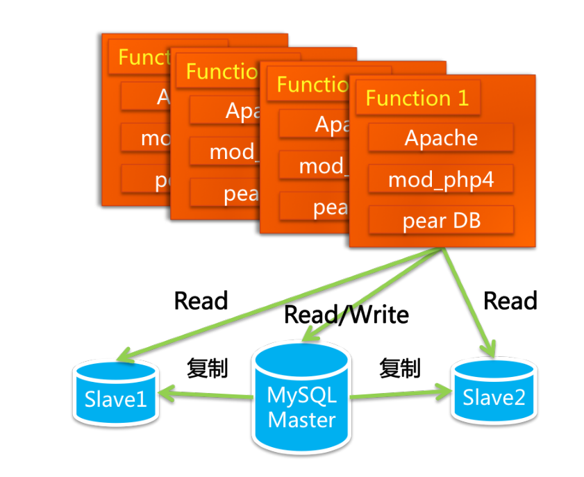
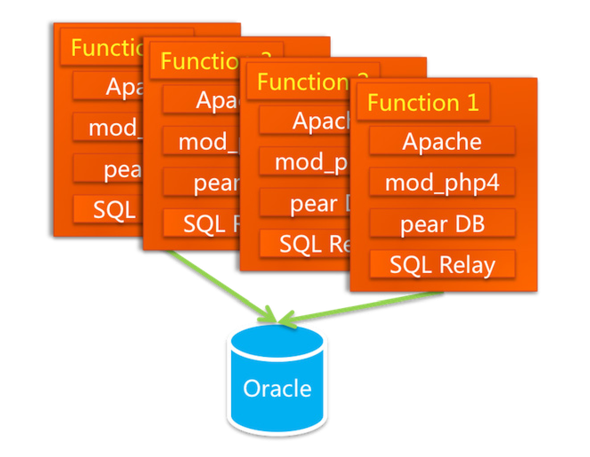

# 淘宝技术总结

## 淘宝技术的发展

### 个人网站

LAMP 

    团队:三个开发(虚竹,三丰,多隆), 一个UED(二当家), 三个运营(小宝,阿 珂,破天), 一个经理(财神), 马云和秘书。
    当时的竞争对手eBuy, 易趣
    最初采用LAMP(Linux + Apache + MySQL + PHP)结构, 第一个网站PHPAuction是从 http://www.phpauction.net 买的, 最初结构如下图

    pear DB是PHP的模块, 负责数据访问层  
> LAMP 结构补充

    2003年, 淘宝由最初的1台服务器增至3台, 一台负责发送Email、一台负责运行数据库、一台负责运行 WebApp
    2003年7月, 多隆又把阿里巴巴中文站 的搜索引擎iSearch搬了过来

> 相关问题

    随着访问量和数据量的飞速上涨, MySQL当时是第4版的，我们用的是默 认的存储引擎MyISAM，这种存储引擎在写数据的时候会把表锁 住。当Master同步数据到Slave的时候，会引起Slave写，这样在Slave 的读操作都要等待。还有一点是会发生Slave上的主键冲突，经常会 导致同步停止,当年的MySQL不比如今的MySQL，在数据的容 量和安全性方面也有很多先天的不足（和Oracle相比）

> 策略

    2003年底, 访问量和交易量迅速上涨, MySQL已经撑不住了，技术的替代方案非常 简单，就是换成Oracle。换为Oracle的原因除了它容量大、稳定、 安全、性能高之外，还有人才方面的原因。在2003年的时候，阿 里巴巴已经有一支很强大的DBA团队了，有鲁国良、冯春培、 汪海（七公）这样的人物，后来还有冯大辉（@fenng）、陈吉 平（拖雷）

> 相关问题

    换库不仅仅是换个数据库, 其访问方式和SQL都要变  
    Oracle的性能和并发访问能力 之所以如此强大，有一个关键性的设计——连接池，连接池中放 的是长连接，是进程级别的，在创建进程的时候，它就要独占一部分内存空间
    而PHP对数据库的访问是很直接的, 每一个请求就是一个连接  ---------------   引入开源连接池代理服务SQL Relay(由多隆进行改造), 结构如下

    采用NAS+Oracle RAC实现负载均衡, 后来发现NAS的NFS（Network File System）协议传输的延迟很严重  ---    换用了Dell和EMC合作的SAN低端存储  
    存储节点才分导致RAC出问题  -----  换用了小型机
    SQL Relay 内部逻辑不对, 代理服务器经常死锁  -----  每天重启

> **任何牛B的人物，都有一段苦B的经历**

### Java时代

    2004年SQL Relay的问题解决不了, 数据库必须要用Oracle, 所以只能考虑Java了  
    Java的优点:
        Java是但是最诚实的网站卡法语言
        有比较良好的企业开发框架
        Java人才多, 维护成本低
        开源框架多

> 脱胎换骨之后的架构
> WebX(MVC) + EJB(控制层) + ibatis(持久层)

> 相关技术:

        Struts: Web应用框架, 本质上相当于一个Servlet;
        WebX: 阿里自己的MVC框架(基于Jakarta Turbine -- Servlet框架包,类似于Struts), 页面模板支持JSP和Velocity, 持久层支持ibatis和hibernate等, 控制层支持EJB和Spring;
        Velocity: velocity是一种基于java的模版引擎(template engine);
        JSP: Java Server Page, 类似于html;
        EJB: Enterprise Java Bean(企业组件模式);
        Spring: Java EE全栈式框架
        ibatis: 数据库持久层框架, 现在叫MyBatis, 通过xml mapper文件映射
        Hibernate: 数据库持久层框架, 通过注解的形式关联
        
> iSearch

    在LAMP时已经引用, 脱胎换骨之后, 只是替换了一下数据源
    原理:
        就是把数据库里的数据dump（倾倒）成结构化的文本文件后，放 在硬盘上，提供Web应用以约定的参数和语法来查询这些数据

> 技术演变

    MySQL撑 不住之后换为Oracle，Oracle的存储一开始在本机上，后来在NAS 上，NAS撑不住了用EMC的SAN存储，再后来，Oracle的RAC撑 不住了，数据的存储方面就不得不考虑使用小型机
    Oracle就运行在 了小型机上，存储方面，从EMC低端CX存储到Sun oem hds高端 存储，再到EMC dmx高端存储

到2004年底，淘宝网已经有4百多万种商品了，日均4千多万 个PV，注册会员达400万个，全网成交额达10亿元。

> IOE(IBM小型机, Oracle, EMC存储)

> DBRoute(由行癫开发), 统一处理数据的合并, 排序, 分页等操作, 像使用一个库一样操作两个库  
> 2005-2006 EJB 替换成 Spring  
> 2005年, 商品数1663万, PC8931万个, 注册会员1390万, 为了提升速度, 启用**缓存**和**CDN**(内容分发网络)
> 之后的系统结构

> 2006年, 日均PV1.5亿, 商品数5千多万, 注册会员3千多万, 全网成交额169亿元
> 2010年, 后端系统保存图片文件286亿个, 平均大小17.45kb, 小于8kb的占61%

### 创造技术
LAMP(200305-200401) -> Oracle, iSearch(200401-200405) -> Java(200402-200503) -> IOE -> 分库,缓存,CDN(200410-200701)

### 分布式时代

### 中间件

### Session框架

### 开放平台

