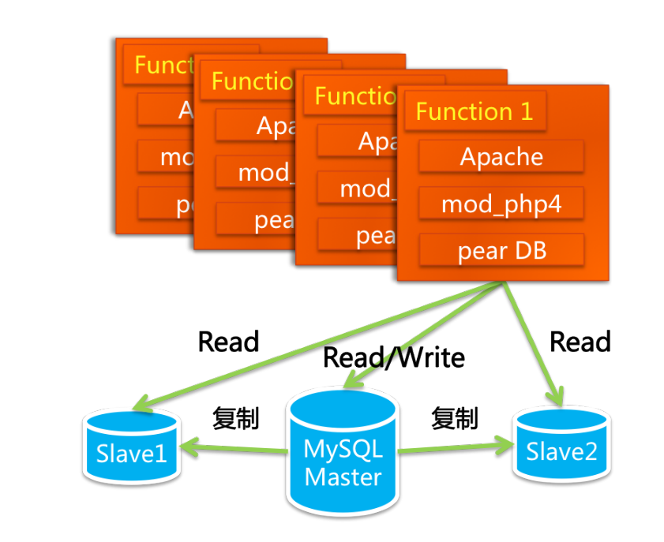
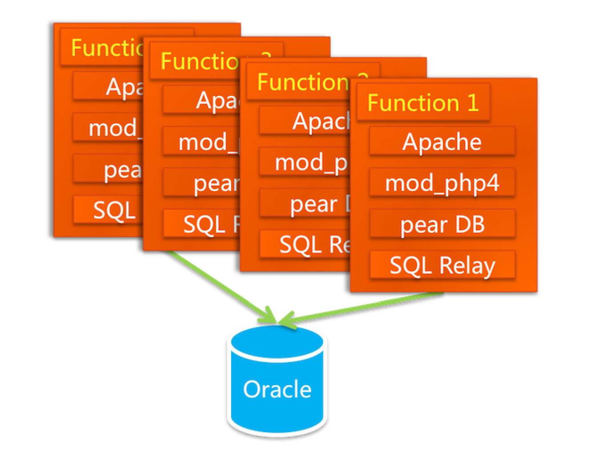
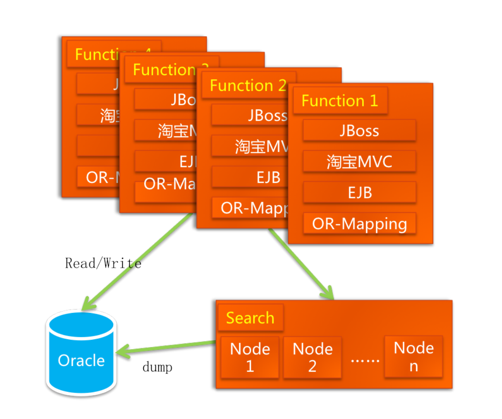
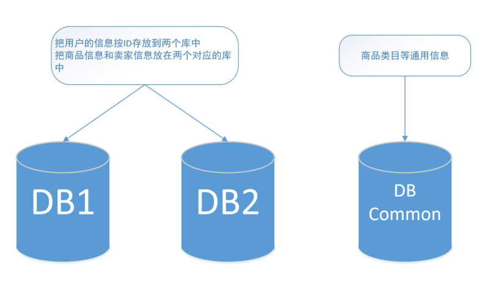
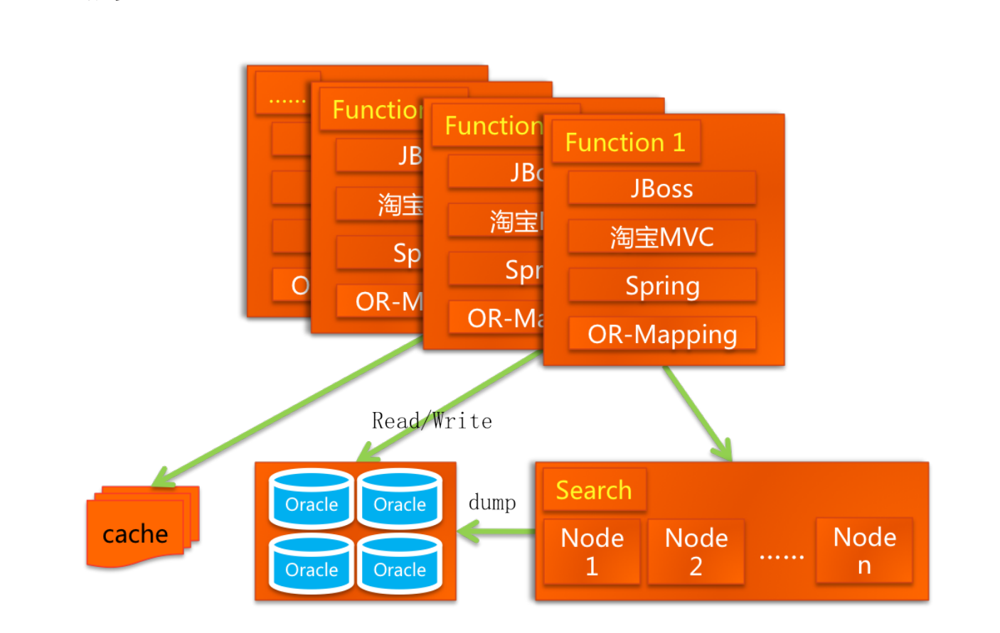
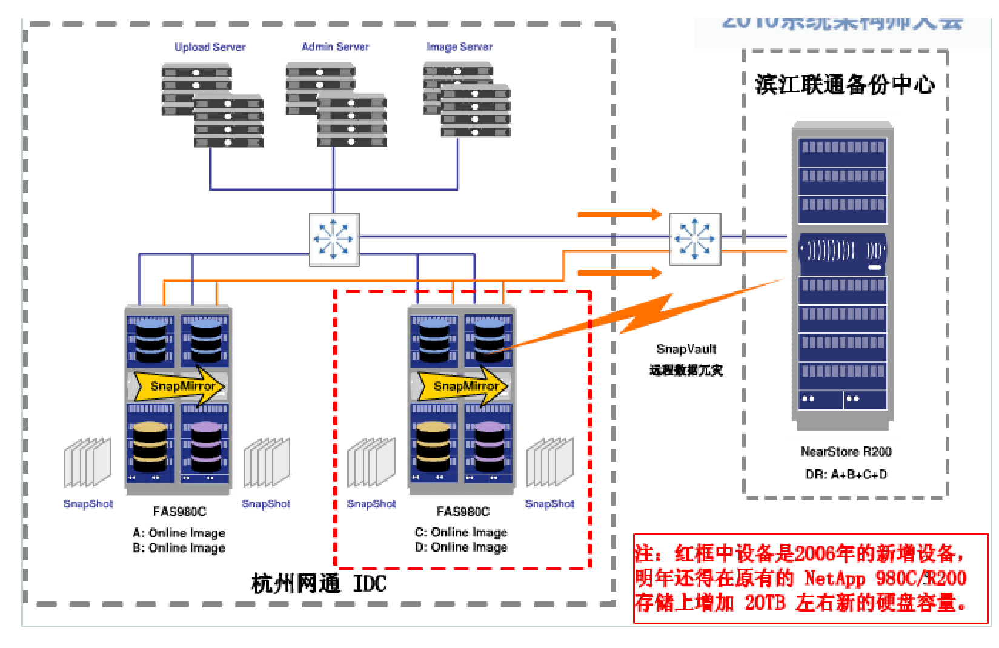
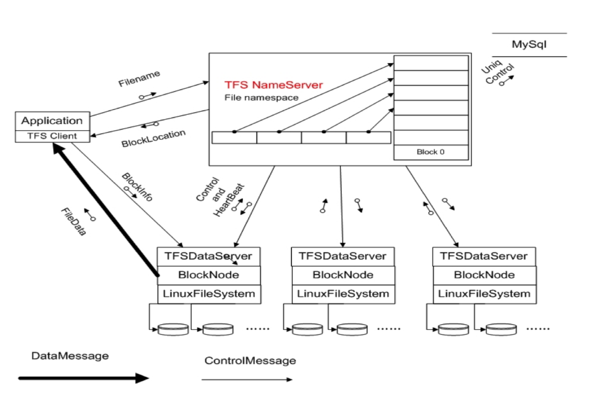
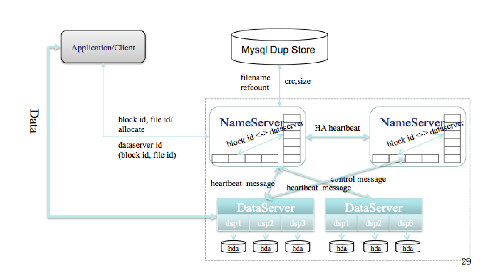
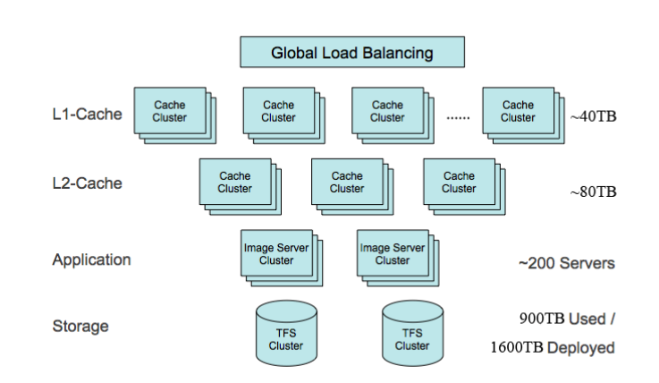

# **淘宝技术总结**

## 淘宝技术的发展

### **个人网站**
* * *

#### [LAMP]

* 团队:三个开发(虚竹,三丰,多隆), 一个UED(二当家), 三个运营(小宝,阿 珂,破天), 一个经理(财神), 马云和秘书。
当时的竞争对手eBuy, 易趣
最初采用LAMP(Linux + Apache + MySQL + PHP)结构, 第一个网站PHPAuction是从 http://www.phpauction.net 买的, 最初结构如下图  

- pear DB是PHP的模块, 负责数据访问层

> LAMP 结构补充

2003年, 淘宝由最初的1台服务器增至3台, 一台负责发送Email、一台负责运行数据库、一台负责运行 WebApp
2003年7月, 多隆又把阿里巴巴中文站 的搜索引擎iSearch搬了过来

> 相关问题

- 随着访问量和数据量的飞速上涨, MySQL当时是第4版的，我们用的是默 认的存储引擎MyISAM，这种存储引擎在写数据的时候会把表锁住。当Master同步数据到Slave的时候，会引起Slave写，这样在Slave 的读操作都要等待。
- 还有一点是会发生Slave上的主键冲突，经常会 导致同步停止,当年的MySQL不比如今的MySQL，在数据的容 量和安全性方面也有很多先天的不足（和Oracle相比）  

> 策略
- 2003年底, 访问量和交易量迅速上涨, MySQL已经撑不住了，技术的替代方案非常简单，就是换成Oracle。换为Oracle的原因除了它容量大、稳定、安全、性能高之外，还有人才方面的原因。在2003年的时候，阿 里巴巴已经有一支很强大的DBA团队了，有鲁国良、冯春培、 汪海（七公）这样的人物，后来还有冯大辉（@fenng）、陈吉 平（拖雷）

> 相关问题

- 换库不仅仅是换个数据库, 其访问方式和SQL都要变  
- Oracle的性能和并发访问能力 之所以如此强大，有一个关键性的设计——连接池，连接池中放 的是长连接，是进程级别的，在创建进程的时候，它就要独占一部分内存空间
- 而PHP对数据库的访问是很直接的, 每一个请求就是一个连接  ---------------   引入开源连接池代理服务SQL Relay(由多隆进行改造), 结构如下

> 策略
- 采用NAS+Oracle RAC实现负载均衡, 后来发现NAS的NFS（Network File System）协议传输的延迟很严重  ---    换用了Dell和EMC合作的SAN低端存储  
- 存储节点才分导致RAC出问题  -----  换用了小型机
- SQL Relay 内部逻辑不对, 代理服务器经常死锁  -----  每天重启

**
<h2>任何牛B的人物，都有一段苦B的经历</h2>
**

### **[Java时代]**
* * *

- 2004年SQL Relay的问题解决不了, 数据库必须要用Oracle, 所以只能考虑Java了  
- Java的优点:
    + Java是但是最诚实的网站卡法语言
    + 有比较良好的企业开发框架
    + Java人才多, 维护成本低
    + 开源框架多
 
 
 

> 脱胎换骨之后的架构  
> WebX(MVC) + EJB(控制层) + ibatis(持久层)

> 相关技术:

- [Struts](https://baike.baidu.com/item/Struts): Web应用框架, 本质上相当于一个Servlet;
- [WebX](https://baike.baidu.com/item/Webx/3706660?fr=aladdin): 阿里自己的MVC框架(基于Jakarta Turbine -- Servlet框架包,类似于Struts), 页面模板支持JSP和Velocity, 持久层支持ibatis和hibernate等, 控制层支持EJB和Spring;
- [Velocity](https://www.cnblogs.com/avivaye/p/4418878.html): velocity是一种基于java的模版引擎(template engine);
- [JSP](https://baike.baidu.com/item/JSP/141543?fr=aladdin): Java Server Page, 类似于html;
- [JBoss](https://baike.baidu.com/item/JBoss): EJB的容器和服务器, 一般与Tomcat或Jetty一起使用, 
- [EJB](https://baike.baidu.com/item/EJB/144195?fr=aladdin): Enterprise Java Bean(企业组件模式);
- [Spring](https://baike.baidu.com/item/spring%E6%A1%86%E6%9E%B6/2853288?fr=aladdin): Java EE全栈式框架
- [ibatis](https://baike.baidu.com/item/ibatis/10787592?fr=aladdin): 数据库持久层框架, 现在叫MyBatis, 通过xml mapper文件映射
- [Hibernate](https://baike.baidu.com/item/Hibernate/206989?fr=aladdin): 数据库持久层框架, 通过注解的形式关联
        
> iSearch

- 在LAMP时已经引用, 脱胎换骨之后, 只是替换了一下数据源
- 原理:  
    就是把数据库里的数据dump（倾倒）成结构化的文本文件后，放 在硬盘上，提供Web应用以约定的参数和语法来查询这些数据

> 技术演变

- MySQL撑 不住之后换为Oracle，Oracle的存储一开始在本机上，后来在NAS 上，NAS撑不住了用EMC的SAN存储，再后来，Oracle的RAC撑 不住了，数据的存储方面就不得不考虑使用小型机
- Oracle就运行在 了小型机上，存储方面，从EMC低端CX存储到Sun oem hds高端 存储，再到EMC dmx高端存储

  
<u>到2004年底，淘宝网已经有4百多万种商品了，日均4千多万 个PV，注册会员达400万个，全网成交额达10亿元。</u>

> IOE(IBM小型机, Oracle, EMC存储)

- DBRoute(由行癫开发), 统一处理数据的合并, 排序, 分页等操作, 像使用一个库一样操作两个库  
- 2005-2006 EJB 替换成 Spring  
- 2005年, 商品数1663万, PC8931万个, 注册会员1390万, 为了提升速度, 启用**缓存**和**CDN**(内容分发网络)

  
CDN: 内容分发网络(Content Delivery Network), 就近取资源, 最开始用的CDN是ChinaCache 提供的, 全网处理能力超过500Gbps, 后来换用了淘宝自己的CDN(章文嵩带入搭建), 支撑了800Gbps以上的流量

> 之后的系统结构, 淘宝2.1

- 2006年, 日均PV1.5亿, 商品数5千多万, 注册会员3千多万, 全网成交额169亿元
- 2010年, 后端系统保存图片文件286亿个, 平均大小17.45kb, 小于8kb的占61%

### **创造技术**
- - -
[LAMP](#lamp)(200305-200401) -> [Oracle](#oracle), iSearch(200401-200405) -> [Java](#java%E6%97%B6%E4%BB%A3)(200402-200503) -> IOE -> 分库,缓存,CDN(200410-200701)

> TFS - 为解决自身图片存储问题而生

2007年之前的图片存储架构

2007年, Google发布GFS, 淘宝有了借鉴的对象, 之后诞生了TFS(Taobao File System), 2007年06月, TFS正式上线运营, 集群规模200(160G)台, 文件数达到上亿级别, 系统部署存储容量140TB, 实际存储容量50TB, 单台支持随机IOPS(Input/Output Operations Per Second) 200+, 流量为3MB/s

- 淘宝对图片存储的需求:
    - 文件较小; 并发量高; 读大于写; 随机访问; 无修改; 成本低; 能容灾; 能备份; 平滑扩容

> TFS 1.0

- 每个Data Server 运行在一台Linux主机上
- 以Block文件的形式存储数据文件(64MB/Block)
- Block存储多分是为了保证数据安全
- 利用ext3文件系统存放数据文件
- 磁盘raid5做数据冗余
- 文件名内置元数据信息, 用户自己保存TFS文件名与实际文件的对照关系
- TFS中, 图片保存的文件名暗藏元数据信息(大小,时间,访问频次,逻辑块号)(为什么微信上传图片后会改变名称??)
- https://img.alicdn.com/imgextra/i2/1621790841/O1CN01oKKaou1I5DaOiRWz6_!!1621790841.jpg

**
业务满足不了的时候, 技术必须创新, 技术创新之后, 业务有了更大的发展空间
**

<u>2009年06月, TFS 1.3发布, PC服务器增至440(300B)+30(600B)台, 文件数达百亿级别, 系统部署存储容量1800TB; 实际存储容量995TB; 单台随机IOPS 900+, 流量 15MB+</u>

> TFS1.3 结构图

> 性能优化:
- 采用ext4文件系统, 并且预分配文件, 减少ext3等文件系统数据碎片带来的性能损耗;
- 单进程管理单块磁盘的方式, 摒除RAID5机制;
- 带有HA机制的中央控制节点, 在安全稳定和性能复杂度之间取得平衡;
- 缩减元数据大小, 将更多的元数据加载到内存中, 提升访问速度;
- 跨机构IDC(互联网数据中心)的负载均很及安全策略;
- 完全平滑扩容;

> 补充
- ext: 扩展文件系统(Extended Filesystem), 是一种日志文件系统, 常用于Linux系统中;
- 日志文件系统: 是一个具有故障恢复能力的文件系统，在这个文件系统中，因为对目录以及位图的更新信息总是在原始的磁盘日志被更新之前写到磁盘上的一个连续的日志上，所以它保证了数据的完整性;
- RAID: 磁盘阵列（Redundant Arrays of Independent Drives，RAID）, 由很多块独立的磁盘，组合成一个容量巨大的磁盘组, 利用个别磁盘提供数据所产生加成效果提升整个磁盘系统效能。
- RAID5: 分布式奇偶校验的独立磁盘结构

- 在TFS前端, 还部署着200多台图片文件服务器, 用Apache实现, 用于生成缩略图的运算。
- 缩略图采用实时生成的方式, 好处是: 避免后端服务器上存储的图片数量过多, 节约后台存储空间; 缩略图可以更具需求实时生成, 更加灵活。

> Tair, 淘宝缓存机制

- AJAX: (异步Javascript 和 XML)Asynchronous Javascript And XML,
- prototype: JS类库, 能够帮助开发人员轻松建立有交互性良好的web2.0特性富客户端页面。

- 淘宝先是采用ESI(Edge Side Includes)作为缓存, 并且, Oracle Web Cache也支持ESI, 所以决定用ESI作为缓存
- TBstore: 多隆写的一个缓存系统, 一个分布式的基于Berkeley DB的缓存系统;
- 推出之后，在阿里巴巴集团 内部使用非常广泛，特别是对于淘宝，TBstore上应用了ESI（就是 上面说过的那个ESI）- Checkcode（验证码）、Description（前文 说过的商品详情）、Story（心情故事，商品信息里面的一个大字 段，长度仅次于商品详情）、用户信息等内容。

> TBstore实现

- 根据保存的Key（关键字），对key进行Hash算法，取得Hash值，再对Hash值与总Cache服务器数据取模。然后根据取模后的值，找到服务器列表中下标为此值的 Cache服务器。由Java Client API封装实现，应用无须关心。
- TBstore基于Berkeley DB, Berkeley DB数据量超过内存的时候, 就要往磁盘上写数据, 它是可以做持久化存储的, 一旦写入磁盘, 作为缓存的性能就会大幅度下降。

### 分布式时代

### 中间件

### Session框架

### 开放平台

